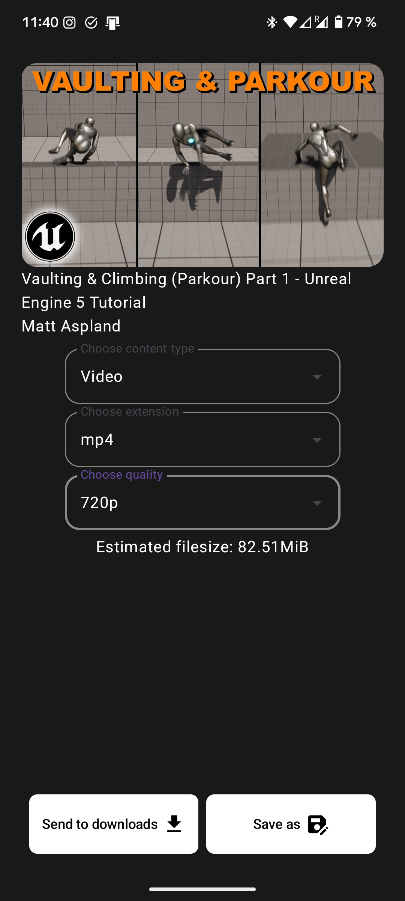
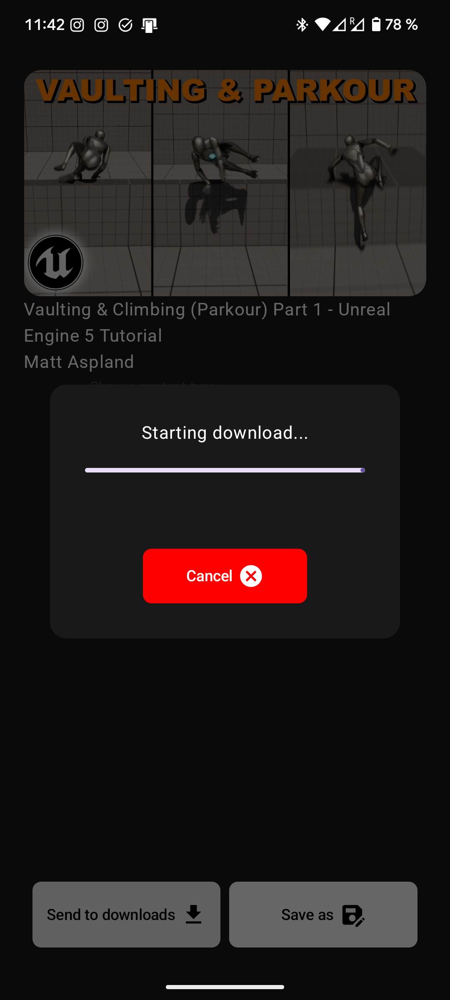
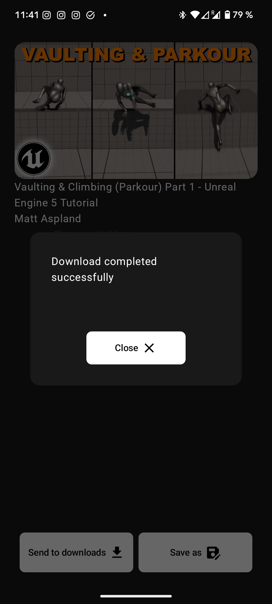

# QuickYTD (Quick YouTube Downloader)

    

**QuickYTD** is an application that can be used to download YouTube videos, focussed on giving a simple and fast experience and UI.
Just paste the link into the text field, select the file, select the desired options and download it!

> QuickYTD uses [**Pytube**](https://github.com/pytube/pytube/tree/master) to interact with YouTube

# Download

- **[Latest release](https://github.com/alex-magter/QuickYTD/releases/latest)**

> A desktop version of the app is in development. For now the Android version is avaliable to use and try.

## Features

- Download videos and audios from YouTube
- Select from diferent resolutions to download the file
- Display the estimated filesize before downloading the file
- Download directly to downloads or save in another directory

## Screenshots

